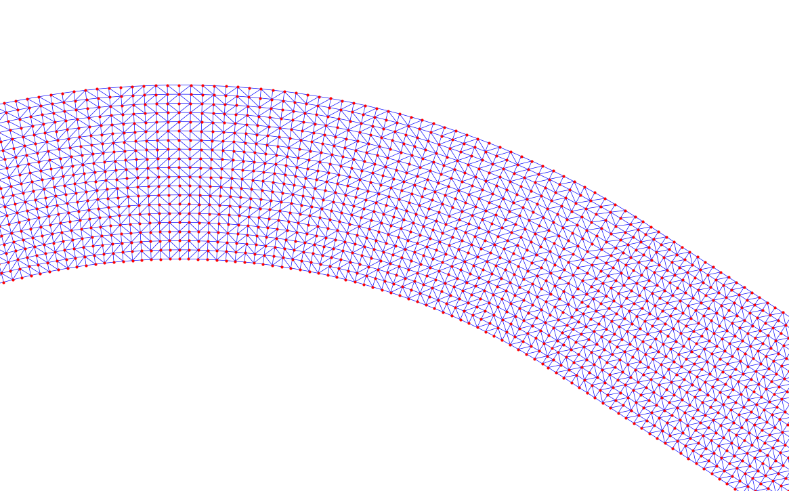

# Segmental environment generator for inland waterways



## Description

Implementation of the generator used in [Paulig and Okhrin (2024)](https://doi.org/10.1016/j.oceaneng.2024.117207).

This generator constructs arbitrary river-like point grids to be used as training and testing environments for simulation-based maritime applications. The generator can create three types of environments:

1. **Rivers**: Alternating straight and curved segments to construct realistic river-like waterways
2. **Canals**: Straight waterway segments for canal-like environments  
3. **Planes**: Flat rectangular grids for general testing purposes

Currents and water depths are assigned to each grid point based on the configuration parameters. The generator can be used as a standalone module or as part of a script.

## Installation

You can install the package via

```console
$ pip install git+https://github.com/nikpau/sr-gen.git
```

## Usage

This generator can be called as a Python module from the command line for standalone use or can be part of a script.

In any case you need to provide a configuration file in `yaml` format. It specifies the parameters for the river generation process.
> The configuration file must contain all fields from the example for the generator to work. In depth explanations of the parameters can be found in the [Configuration files](#configuration-files) section. 

In its default configuration, the generator will utilize the `csv` exporter, which generates two `.csv` files:
1. `coords.csv` containing the x,y coordinates of the generated grid points
2. `metrics.csv` containing the water depth, current velocity components (cx, cy), and total current velocity at each grid point

The exporter can be changed by specifying the `EXPORTER` field in the configuration file. The available exporters are defined in `src/rivergen/exporters.py`. Currently, the available exporters are:

### CSV Exporter
- Generates two `.csv` files:
  1. `coords.csv` - Grid point coordinates (x, y)
  2. `metrics.csv` - Water depth and current velocity data (cy, cx, depth, total_velocity)

### UCD Exporter
- Generates a single UCD compliant file and one `.txt` file:
  1. `generated.inp` contatining the river geometry and its accompanying metrics in UCD format. The mesh triangulation used a contrained Delaunay triangulation using triangles. Other mesh types are not supported natively, but can be added by modifying the `src/rivergen/export.py:UCDExporter::write_to_file()` method.
  2. `Segments.txt` 

Custom exporters can easily be generated. The blueprint for creating a custom exporter can be found under `./src/rivergen/utils.py` in the `BaseExporter` class.

### CLI
```console
$ rivergen -c /path/to/config.yaml
```
You can run the module with the default configuration file at `./configs/example.yaml` to see an example of the building process.

Upon running, the generator will create a folder at the specified location from the configurations `SAVEPATH` argument. For each call, a new folder is created, named by a random hexadecimal UUID and three. This was done to avoid duplicate folder names when calling the generator rapidly e.g. during neural network training. This behavior can be changed under `src/rivergen/utils.py:99`.

#### Options

In case you want to test a configuration without saving it permanently to disk, consider using the `-tc` flag, which temporarily constructs a river from the given configuration and plots it for visual inspection. After closing the plot window, the constructed river is deleted.

If the visual inspection is desired but the result shall be kept, use the `-vc` flag, which keeps the files after inspection.

### Script

The generator can be included in any script by first registering a configuration and then exporting rivers generated from it to a file. For example:

```python
import rivergen

# Get the exporter from the config file
config_file = rg.ConfigFile("/path/to/config.yaml")
config = config_file.config
exporter = config_file.parse()

# Print the configuration
print(config)

# Generate 10 random rivers from this configuration
# and plot them for inspection
for _ in range(10):
    exportpath = exporter.export()
    rivergen.tests.visualize(exportpath,configuration)


```

## Configuration files

The building behavior can be altered via several parameters to be specified inside a `yaml` configuration file. Details about the parameters and the generation process can be found at [Paulig and Okhrin (2024)](https://doi.org/10.1016/j.oceaneng.2024.117207).

A possible configuration could look like this:

```yaml
SEED: -1 # Seed for random number generation. If "-1" seed is chosen randomly
NSEGMENTS: 10 # Total number of segements
MODE: "river" # Generation mode: "river", "canal", or "plane"
GP: 50 #  No. of grid points per segment width
BPD: 20 # distance between gridpoints [m]
EDGELEN: 1000 # Length of plane edges [m] (only used for "plane" mode)
LENGTHS: # Range for straight segments [m] (ξ) (ignored in plane mode)
  LOW: 400
  HIGH: 2000
RADII: # Range of circle radii [m] (r) (ignored in plane mode)
  LOW: 500
  HIGH: 2000
ANGLES: # Range of angles along the circles [deg] (ϕ) (ignored in plane mode)
  LOW: 60
  HIGH: 80
MAX_DEPTH: 7 # River depth at deepest point [m] (κ)
MAX_VEL: 1 # Maximum current velocity [ms⁻¹] (ν)
VARIANCE: 2 # Variance for current and depth rng
START_AT_UTM: -1 # UTM zone to start the river at (-1 for no UTM conversion)

# Path to the directory where the
# generated files will be saved.
# Absolute paths are recommended.
SAVEPATH: "/path/to/save/"

# Name of the exporter class to use.
# Exporters are defined in ./src/rivergen/exporters.py
# and determine the file format of the generated
# river.
EXPORTER: "csv"

# Print information about the generation 
# process to stdout
VERBOSE: True
```

### Generation Modes

The generator supports three different generation modes via the `MODE` parameter:

- **`"river"`**: Generates curved river segments with alternating straight and curved sections
- **`"canal"`**: Generates straight canal segments (RADII and ANGLES parameters are ignored)
- **`"plane"`**: Generates a flat plane grid using the EDGELEN parameter (NSEGMENTS, LENGTHS, RADII, and ANGLES are ignored)

### Backward Compatibility

For backward compatibility, configuration files using the old `CANAL: true/false` format are still supported and will be automatically converted:
- `CANAL: true` → `MODE: "canal"`
- `CANAL: false` → `MODE: "river"`
> The configuration file must contain all fields from the example for the generator to work.
